# Guide to deploy the OpenTelemetry Demo locally using Helm and exporting telemetry data to Coralogix

If you are new to this observability thing, knowing where to start can be daunting. 
Thankfully there is OpenTelemetry. 
OpenTelemetry is an open-source observability framework that provides standardized APIs, libraries, and agents for collecting telemetry data, including traces, metrics, and logs. It helps you gain deep insights into your application performance and troubleshoot issues effectively. By supporting multiple backends, OpenTelemetry ensures vendor-neutral observability. This is really important, because it reduces risk. 
The collaborators of the OpenTelemetry project have built and made publicly accessible their OpenTelemetry Demo code-base on [GitHub](https://github.com/open-telemetry/opentelemetry-demo). The OpenTelemetry Demo is a microservices-based application designed to showcase OpenTelemetry’s capabilities in real-world scenarios. It includes various services written in different languages, such as Go, Java, and JavaScript, simulating a typical cloud-native architecture. The demo generates traces, logs, and metrics, demonstrating how OpenTelemetry can instrument applications for end-to-end observability. 
This means you can explore OpenTelemetry in action, experiment with different configurations, and understand how to integrate it into your applications. By leveraging OpenTelemetry, your team can build more reliable, efficient, and well-monitored distributed systems. This fantastic resource will guide through instrumenting a code-base to advance further your understanding of your application. It’s backed by tens of thousands of hours of engineering acumen, so that you can further your understanding. Just one more reason why I love the open-source community. The project is part of the Cloud Native Computing Foundation (CNCF), which is part of The Linux Foundation Consortium. Which means you’re in good hands.

## Before You Begin
### Prerequisites
- **Docker**: Latest stable version for building the OTel Demo application.
- **kubectl**: Kubernetes command-line tool. kubectl can be installed on a Mac using HomeBrew, ```$ brew install kubectl```
- **Helm Package Manager**: This guide uses to Helm to install the OpenTelemetry Demo Helm charts. Helm can be installed on a Mac using HomeBrew, ```$ brew install helm```
- **Kubernetes Cluster**: This guide uses Kind for local development, Kind runs Kubernetes inside a Docker container. The Kubernetes team uses Kind to test Kubernetes itself. Kind can be installed on a Mac using HomeBrew, ```$ brew install kind```
- **Coralogix Account**: Sign up to [Coralogix](https://dashboard.eu2.coralogix.com/#/signup), instructions below. You’ll need this for testing and visualization, along with a valid API key for the backend telemetry data. 
- **Basic Knowledge**: Familiarity with Docker, YAML, and monitoring concepts.
- To view the code-base, clone the OpenTelemetry Demo [repo](https://github.com/open-telemetry/opentelemetry-demo) from GitHub to your local machine. 
- Tested Environment: MacBook Air M3, Visual Studio Code

Estimated Time to complete the integration: 10-15 minutes

### Signing Up with Coralogix and Creating an API Key
Create a free Coralogix account by visiting [Coralogix](https://coralogix.com/) and signing up with an email and password.

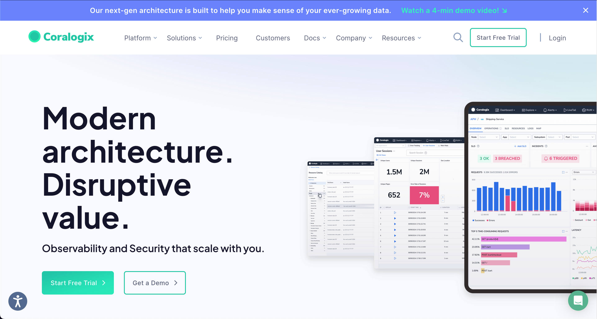

once signed up, navigate to DataFlow > API Keys 

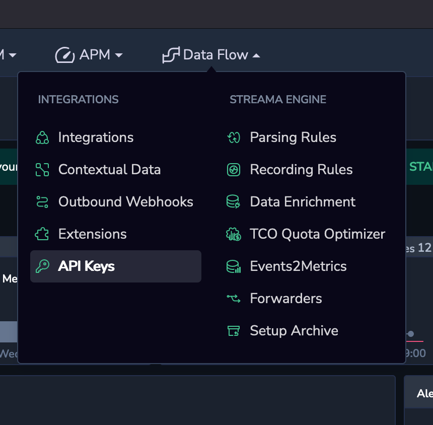

to generate a new key.

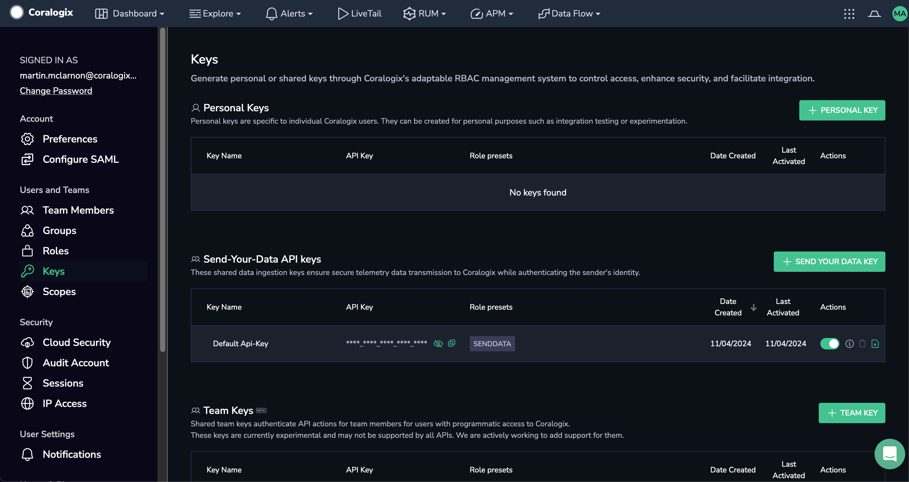

I clicked on "SEND YOUR DATA KEY"

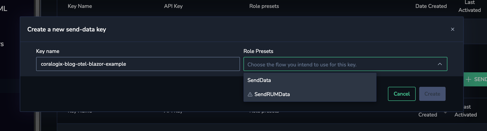

gave the API key a relevant name and chose the "SendData" flow for the key and clicked "Create".

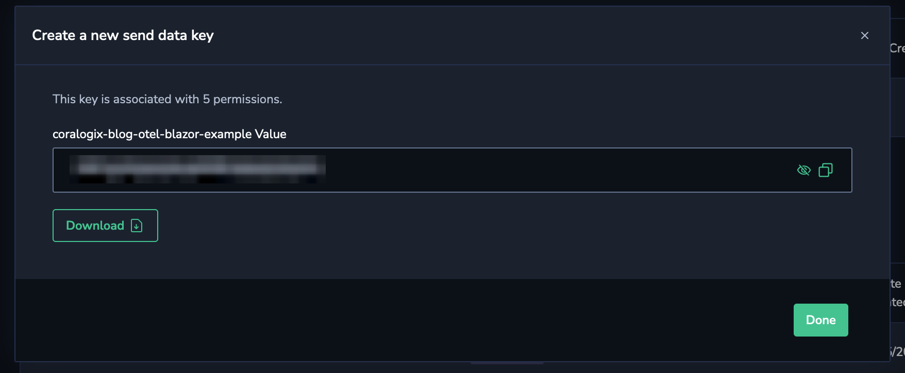

Now you have an API key which can be copied or downloaded in a JSON format. 

The API key acts as a unique identifier, linking your app’s telemetry data to your Coralogix account.

Coralogix domains can be viewed [here](https://coralogix.com/docs/user-guides/account-management/account-settings/coralogix-domain/).

Steps:

1. Open a terminal and run the following command:
   ```bash
   $ kind create cluster -n my-otel-demo
   ```
2. Go to your Coralogix account and navigate to Data Flow -> Integrations and search for Kubernetes
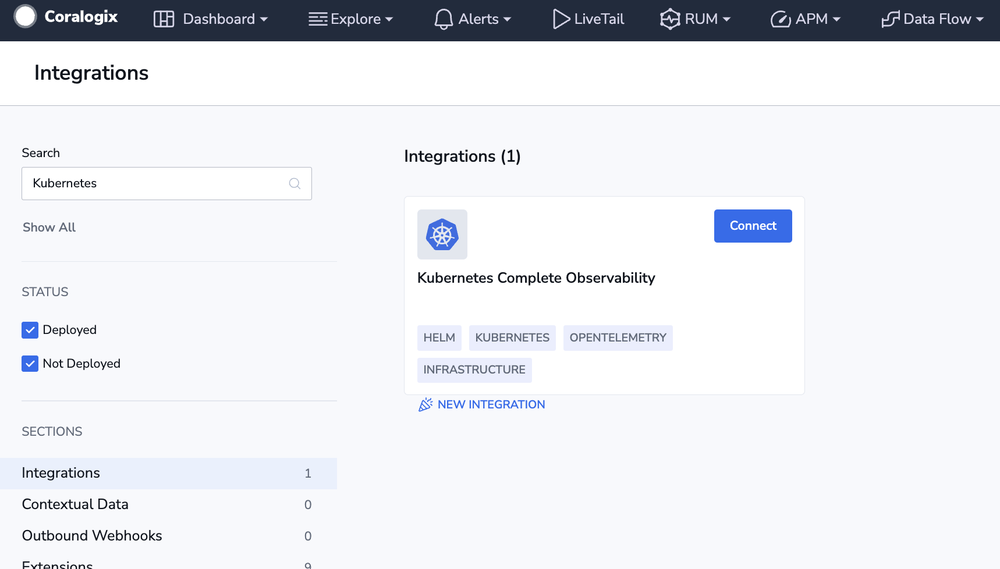
and click connect.
3. Follow the set up instructions to add Coralogix’s Kubernetes Complete Observability Integration to the cluster you have just created.
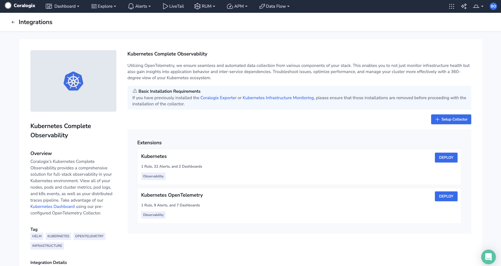
click the "+ Setup Collector" button.
4. Click the "Create a New Key" button and give the API Key a suitable name.
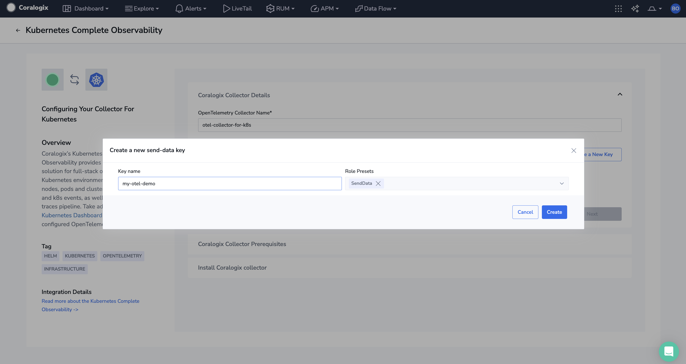
Now you have an API key which can be copied or downloaded in a JSON format. 
5. Click the "Next" button and follow the instructions
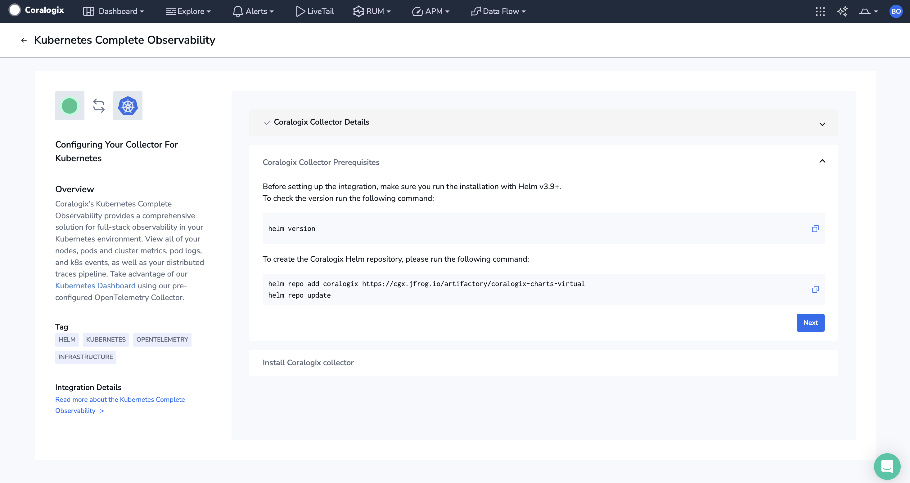
running the commands on the screen in the cluster you created in step 1.
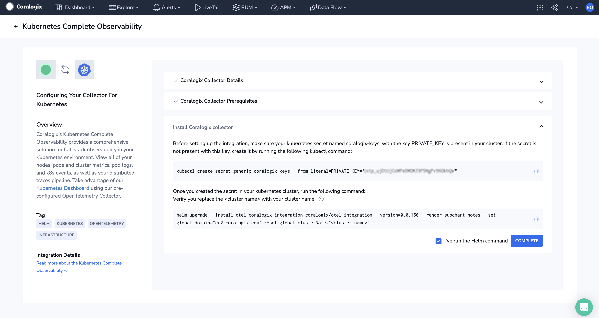
6. Now the Coralogix’s Kubernetes Complete Observability Integration has been added to your cluster. Click on the "Kubernetes OpenTelemetry" extension.
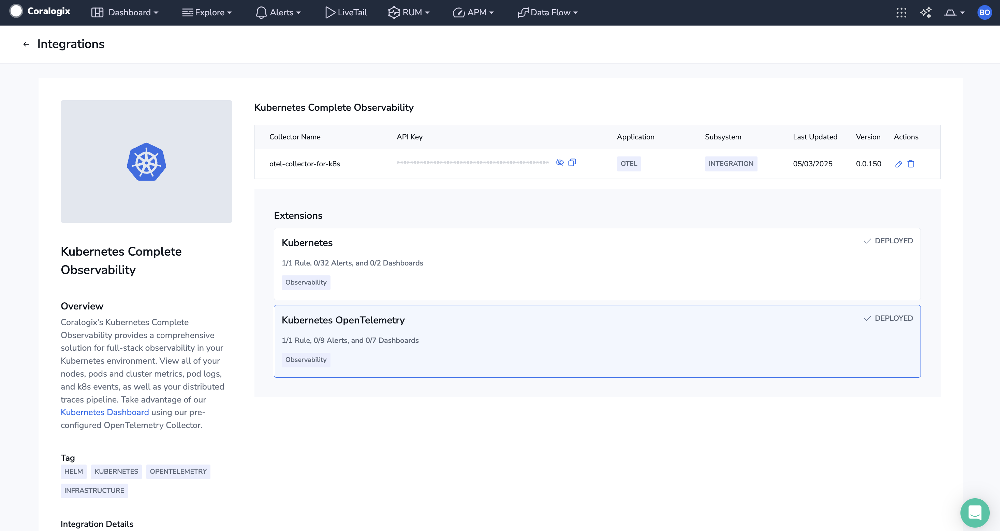
7. Check "Select All" on the Alerts tab and "Select All" on the Coralogix Dashboards tab and click the "Update" button at the top of the page.
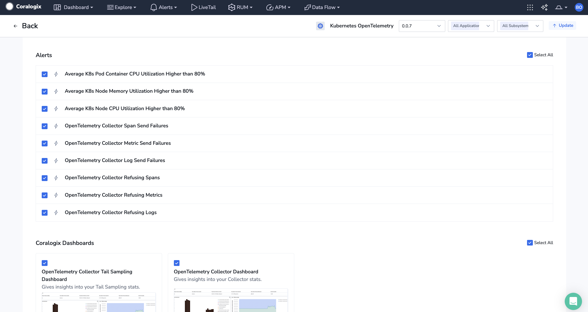
8. Navigate to Dashboard > k8s Dashboard
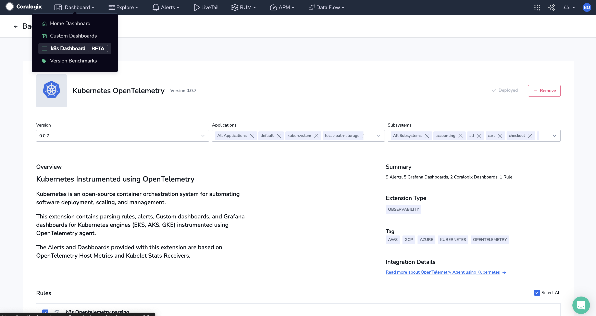
now you have infrastructure monitoring in place for the cluster.
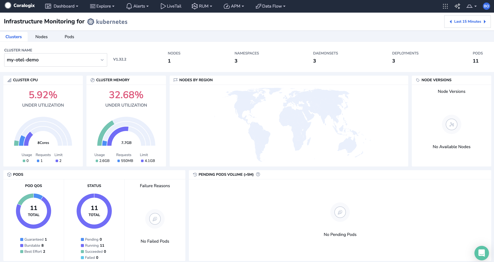
9. Create a local folder ```./my-otel-demo```.
10.  Next, create a file in the local folder ```./my-otel-demo``` called ```otel-config-value.yml```.
11.  
12.  Update the file ```otel-config-value.yml``` with the following code:
   ```yaml
   opentelemetry-collector:
    config:
        exporters:
        coralogix:
            domain: "<YOUR_CORALOGIX_REGION>"
            private_key: "<YOUR_CORALOGIX_API_KEY>"
            application_name: "<YOUR_APPLICATION_NAME>"
            subsystem_name: "<YOUR_SUBSYSTEM_NAME>"
            timeout: 30s

        service:
        pipelines:
            traces:
            exporters: [spanmetrics, coralogix]
            logs:
            exporters: [coralogix]
            metrics:
            exporters: [coralogix]
   ```
5.  then run the following command:
   ```bash
   $ helm repo add open-telemetry https://open-telemetry.github.io/opentelemetry-helm-charts
   $ helm repo update
   ```
6.  then run the following command:
   ```bash
   $ helm install my-otel-demo open-telemetry/opentelemetry-demo
   ```
7.  then run the following command:
   ```bash
   $ helm upgrade my-otel-demo open-telemetry/opentelemetry-demo -f otel-values.yaml
   ```
8.  The application will take approximately 10 minutes to build.
9.  Run the following command to confirm the pods are running:
   ```bash 
   $ kubectl get pods
   ```
10. When all the pods are running, run the following command:
   ```bash
      $ kubectl -n default port-forward svc/frontend-proxy 8080:8080
   ```
11.  Now you can access the following:
- **Web store:** http://localhost:8080/
- **Grafana:** http://localhost:8080/grafana/
- **Load Generator UI:** http://localhost:8080/loadgen/
- **Jaeger UI:** http://localhost:8080/jaeger/ui/
- **Flagd configurator UI:** http://localhost:8080/feature
12.  Navigate to your Coralogix Account.


